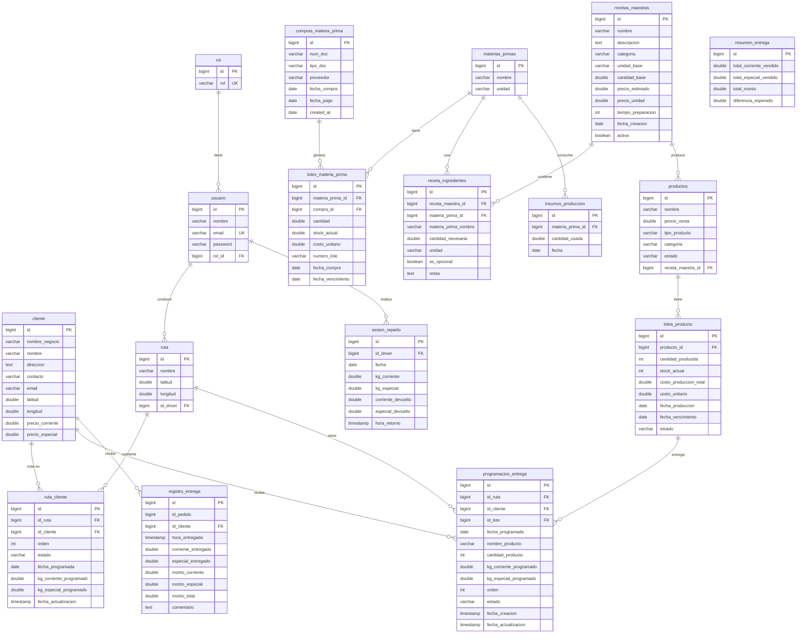
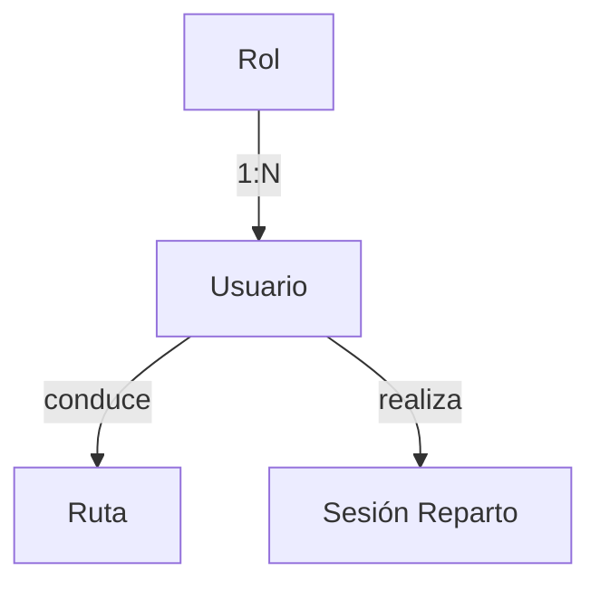
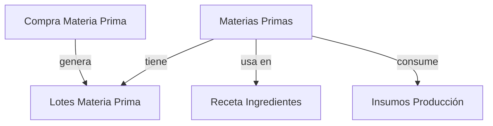
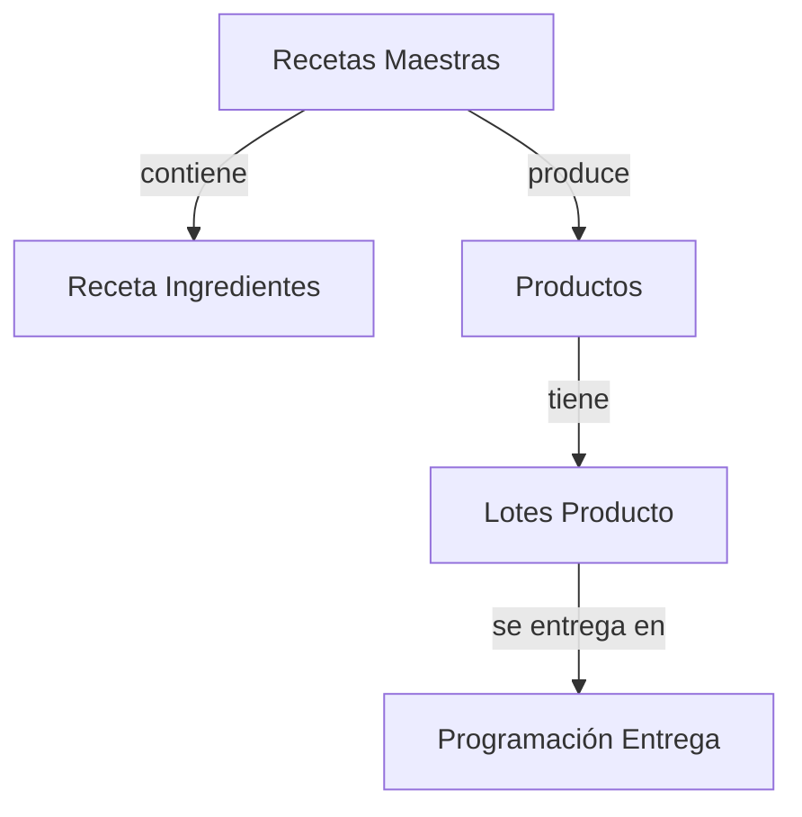
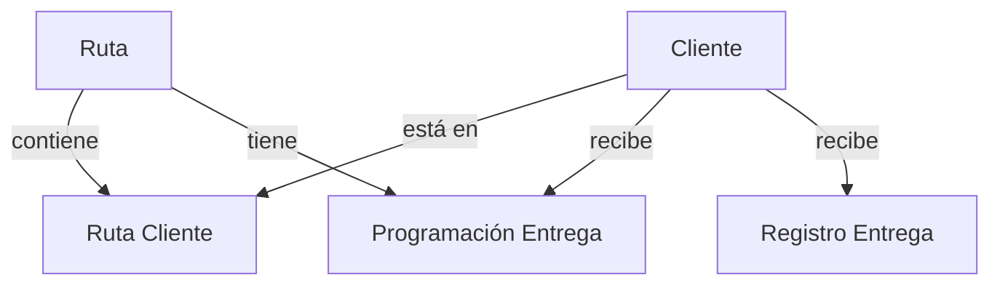

# 📊 Diagrama de Relaciones - Base de Datos Fluxora

## Diagrama Completo (Mermaid)



---

## Vista Simplificada por Módulos

### 1. Módulo de Usuarios



### 2. Módulo de Inventario - Materias Primas



### 3. Módulo de Productos y Recetas



### 4. Módulo de Entregas



---

## Cardinalidad de Relaciones

| Tabla Origen              | Relación   | Tabla Destino        | Cardinalidad |
| ------------------------- | ---------- | -------------------- | ------------ |
| **rol**                   | tiene      | usuario              | 1:N          |
| **usuario**               | conduce    | ruta                 | 1:N          |
| **usuario**               | realiza    | sesion_reparto       | 1:N          |
| **cliente**               | está en    | ruta_cliente         | 1:N          |
| **cliente**               | recibe     | programacion_entrega | 1:N          |
| **cliente**               | recibe     | registro_entrega     | 1:N          |
| **ruta**                  | contiene   | ruta_cliente         | 1:N          |
| **ruta**                  | tiene      | programacion_entrega | 1:N          |
| **materias_primas**       | tiene      | lotes_materia_prima  | 1:N          |
| **materias_primas**       | usa en     | receta_ingredientes  | 1:N          |
| **materias_primas**       | consume    | insumos_produccion   | 1:N          |
| **compras_materia_prima** | genera     | lotes_materia_prima  | 1:N          |
| **recetas_maestras**      | contiene   | receta_ingredientes  | 1:N          |
| **recetas_maestras**      | produce    | productos            | 1:N          |
| **productos**             | tiene      | lotes_producto       | 1:N          |
| **lotes_producto**        | entrega en | programacion_entrega | 1:N          |

---

## Relaciones Clave

### Relaciones Obligatorias (NOT NULL)

- `usuario.rol_id` → `rol.id`
- `lotes_materia_prima.materia_prima_id` → `materias_primas.id`
- `lotes_producto.producto_id` → `productos.id`
- `ruta_cliente.id_ruta` → `ruta.id`
- `ruta_cliente.id_cliente` → `cliente.id`

### Relaciones Opcionales (NULL permitido)

- `ruta.id_driver` → `usuario.id` (puede no tener driver asignado)
- `productos.receta_maestra_id` → `recetas_maestras.id` (productos sin receta)
- `lotes_materia_prima.compra_id` → `compras_materia_prima.id` (lotes legacy)

---

## Flujos de Negocio Principales

### 1. Flujo de Compra de Materias Primas

```
Compra Materia Prima
    ↓
Lotes Materia Prima (cantidad inicial = stock_actual)
    ↓
Se consume en producción (stock_actual disminuye)
    ↓
Insumos Producción (registro histórico)
```

### 2. Flujo de Producción

```
Receta Maestra
    ↓
Receta Ingredientes (lista de materias primas)
    ↓
Consumo de Lotes Materia Prima (FIFO)
    ↓
Lotes Producto (con costo calculado PPP)
    ↓
Stock disponible para entregas
```

### 3. Flujo de Entregas

```
Ruta (asignada a driver)
    ↓
Ruta Cliente (clientes a visitar)
    ↓
Programación Entrega (productos y cantidades)
    ↓
Sesión Reparto (inventario cargado)
    ↓
Registro Entrega (entrega real)
    ↓
Resumen Entrega (consolidado financiero)
```

---

## Índices por Tabla

| Tabla                     | Índices                                                        |
| ------------------------- | -------------------------------------------------------------- |
| **usuario**               | email, rol_id                                                  |
| **cliente**               | email, (latitud, longitud)                                     |
| **materias_primas**       | nombre                                                         |
| **lotes_materia_prima**   | materia_prima_id, compra_id, fecha_vencimiento, stock_actual   |
| **compras_materia_prima** | fecha_compra, proveedor, num_doc                               |
| **recetas_maestras**      | nombre, activa                                                 |
| **receta_ingredientes**   | receta_maestra_id, materia_prima_id                            |
| **productos**             | nombre, tipo_producto, categoria, receta_maestra_id            |
| **lotes_producto**        | producto_id, fecha_produccion, fecha_vencimiento, stock_actual |
| **ruta**                  | id_driver                                                      |
| **ruta_cliente**          | id_ruta, id_cliente, fecha_programada, estado                  |
| **programacion_entrega**  | id_ruta, id_cliente, fecha_programada, estado                  |
| **sesion_reparto**        | id_driver, fecha                                               |
| **registro_entrega**      | id_pedido, id_cliente, hora_entregada                          |

---

## Visualizar en Herramientas

### DBDiagram.io

Puedes visualizar el esquema en [dbdiagram.io](https://dbdiagram.io/):

1. Copia el contenido del archivo `fluxora_schema.sql`
2. Ve a https://dbdiagram.io/
3. Pega el código SQL o usa el formato DBML

### DBeaver / pgAdmin

1. Conecta a tu base de datos Supabase
2. Ve a ER Diagram
3. Selecciona las tablas que quieres visualizar

---

## Notas Técnicas

- **PK** = Primary Key (Clave Primaria)
- **FK** = Foreign Key (Clave Foránea)
- **UK** = Unique Key (Clave Única)
- **1:N** = Uno a Muchos
- **N:M** = Muchos a Muchos (implementado con tabla intermedia)

---

## Actualizado

Fecha: 14 de noviembre de 2025
Versión: 1.0
